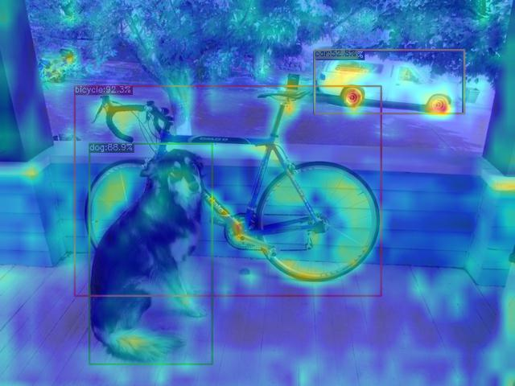

# YOLOX grad-cam/++

Hope to show the cam of special layer

# Thanks

https://github.com/Megvii-BaseDetection/YOLOX  
https://github.com/yizt/Grad-CAM.pytorch  

# Usage

1. Install pytorch 1.9

Config the layer at tools/grad_cam_demo.py:

```python
    cam_layer = [
        "backbone.backbone.dark2.1.conv3",
        "backbone.backbone.dark3.1.conv3",
        "backbone.backbone.dark4.1.conv3",
        "backbone.backbone.dark5.2.conv3",
        "backbone.C3_p3.conv3",
        "backbone.C3_n3.conv3",
        "backbone.C3_n4.conv3",
    ]
```

` python tools/grad_cam_demo.py image -n yolox-s -c weights/yolox_s.pth --save_result`

other opts: --classes

# origin README

see branch main

# Example


